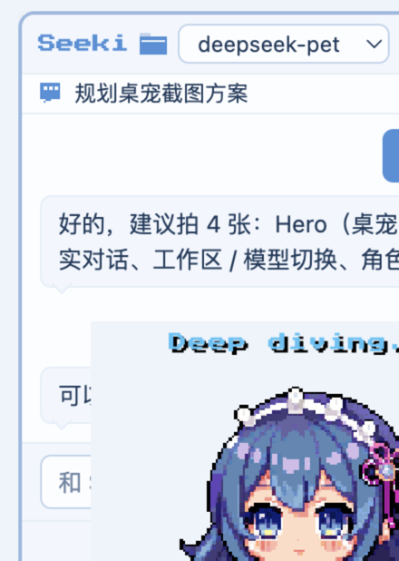
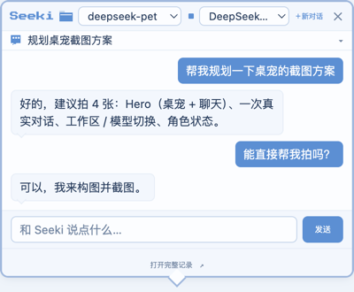
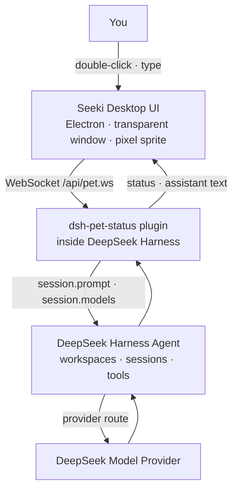

<div align="center">

# Seeki

**A tiny DeepSeek-powered desktop companion that lives on your screen and helps you get things done.**

*[English](./README.md) · [简体中文](./README_CN.md)*

Seeki is a pixel pet that floats on your desktop and keeps a [DeepSeek Harness](https://github.com/deepseek-ai/deepseek-harness) agent one double-click away. It's a **Desktop Pet × DeepSeek × Agent** — persistent conversations organized by workspace, per-task model switching, and a character that actually reacts while your agent is working.

[](./LICENSE)
[](#contributing)

<!--
  TODO: hero screenshot — Seeki pet + chat window, side by side.
  
-->


</div>

> Seeki is an independent community project. It is **not** an official DeepSeek product.

---

## Why Seeki?

You can already talk to DeepSeek in a browser tab. Seeki adds the layer a chat UI can't:

| Instead of… | Seeki gives you… |
|---|---|
| a tab you have to find | a character that **lives on your desktop**, always one glance away |
| pasting context every session | **persistent conversations**, organized into workspaces |
| one default model | **per-task model switching** — pick a different model for the next message |
| a static web app | a **pixel companion** with idle / happy / walking / sleeping states |
| reading logs | an **at-a-glance status bubble** above the character (received → working → done) |

Every one of these maps to something Seeki actually does today — no marketing filler.

---

## Features

### 🐾 Lives on your desktop

Seeki is a transparent, frameless, always-on-top window — a 2D pixel character that stays on your screen instead of hiding in a tab.

### 💬 Persistent conversations

Double-click Seeki to chat. Conversations are **persistent and multi-turn**, organized into **workspaces**, with a conversation switcher to jump back into any previous thread.

### 🧠 A DeepSeek Harness agent behind the pet

Seeki is the desktop face of a [DeepSeek Harness](https://github.com/deepseek-ai/deepseek-harness) agent. The head bubble reflects the agent's live status:

| Status | Bubble |
|---|---|
| `received` | 收到啦 · received |
| `running` | Deep diving... |
| `completed` | Completed |
| `terminated` | Stopped |
| `offline` | Offline |

### 🔀 Per-task model switching

Switch between your configured DeepSeek models straight from the chat window. The switch applies to the **next message only** and never interrupts a running turn; a new conversation inherits the current model.

### 🎮 A character, not a static icon

Idle breathing, happy, walking (drag), and sleeping animations — plus drag-direction switching (left / right / up / down with mirroring) and click / idle-timeout interactions.

### ⚙️ Config-driven, no code edits

Status bubbles, animations, frame rates, and triggers all live in `pet.config.json`, editable through a built-in `/pet/settings` page — including **uploading, replacing, and deleting animation frames**.

---

## Screenshots

> Real product screenshots are being prepared. The slots below mark what to capture; nothing here is a placeholder for a feature that doesn't exist.

<!--
### Hero — Seeki + chat window


### Conversation


### Workspace & model switching


### Character states

-->

**Screenshot plan (what to capture):**

1. **Hero** — Seeki pet next to the open chat window (pet + agent UI). *Suggested: 1280×720, placed in the Hero section above.*
2. **Conversation** — a real multi-turn chat, showing the pixel bubble UI. *Suggested: 720×640.*
3. **Workspace & model** — the chat window title bar with the workspace folder selector and the model dropdown. *Suggested: 720×420.*
4. **Character states** — a short GIF of idle → walking → sleeping. *Suggested: 320×320.*

---

## Quick Start

### Prerequisites

- **Node.js ≥ 22** and **pnpm**
- A clone of [deepseek-harness](https://github.com/deepseek-ai/deepseek-harness) with `pnpm install` run once — Seeki runs as a plugin inside it
- A **DeepSeek API key** configured for the harness (see [Model Configuration](#model-configuration))

```sh
# 1. Clone both repos
git clone https://github.com/deepseek-ai/deepseek-harness.git
git clone https://github.com/BenjaminSHI4008/deepseek-pet.git
cd deepseek-harness && pnpm install

# 2. Install Seeki (plugin + a desktop icon)
cd ../deepseek-pet
bash scripts/install.sh
```

```powershell
# Windows (PowerShell)
powershell -ExecutionPolicy Bypass -File scripts\install.ps1
```

3. **Run** — double-click `Seeki.app` (macOS) / `Seeki.lnk` (Windows). The icon launches DeepSeek Harness in the background and wakes Seeki.

The installer auto-detects your `deepseek-harness` checkout (a sibling directory, `~/deepseek-harness`, or `~/Projects/deepseek-harness`) and asks if it can't find it.

---

## Installation

Two ways to run, plus a standalone offline mode.

### A. One-click desktop icon *(recommended)*

`scripts/install.sh` (macOS) / `scripts/install.ps1` (Windows) installs the plugin and creates a **pseudo-executable** desktop icon — it contains only a launch command, no bundled runtime.

- **Start:** double-click → starts the harness in the background → wakes Seeki.
- **Exit:** right-click the pet → 「退出桌宠」. Quitting Seeki **does not** stop the harness (it keeps running in the background; the next double-click just re-wakes the pet).

### B. Run with DeepSeek Harness manually

```sh
cd <deepseek-pet>
bash scripts/install-harness-plugin.sh   # install the plugin into the web profile

cd <deepseek-harness>
pnpm dsh web                            # Seeki auto-launches with the harness
```

### C. Standalone pet (offline, no agent)

```sh
cd <deepseek-pet>
npm install
npm start
```

This runs only the pet. Without a connected harness the bubble shows **Offline**.

> Electron downloads its binary on `npm install`. On slow networks in mainland China, run
> `export ELECTRON_MIRROR="https://npmmirror.com/mirrors/electron/"` first.

---

## Model Configuration

Seeki doesn't hardcode models. The chat window's model list comes from your DeepSeek Harness's configured providers (`llm.models`), so it always reflects what your harness actually advertises (for example **DeepSeek-V4-Pro** and **DeepSeek-V4-Flash** on the `deepseek-official` route).

- **API key** — configure it for the harness, not for Seeki: set `DEEPSEEK_API_KEY` in the environment, in a `.env` file at the harness root, or via the harness's credentials store (`~/.dsh/.credentials.yaml`).
- **Default model** — the harness's own default. Seeki doesn't impose one.
- **Switch models** — use the model dropdown in the chat title bar. It affects the **next message only**; new conversations inherit the current selection; unavailable models show as disabled.

Full `pet.config.json` reference: [docs/config.md](./docs/config.md).

---

## How It Works



1. The **Electron pet** renders the character and the chat window.
2. A small **Cordis plugin** (`dsh-pet-status`) runs inside DeepSeek Harness, folding agent activity into statuses and streaming assistant text over a local WebSocket.
3. The harness **agent** handles sessions, workspaces, and tools; Seeki is its desktop face.

Architecture and extension guide: [docs/development.md](./docs/development.md).

---

## Project Structure

```
harness-plugin/     dsh-pet-status plugin — status broadcast, pet manager, chat bridge
Deepseek/           pixel sprite assets (animations, 8-direction stills, raw sources)
assets/             bundled font (and the generated launcher icon)
docs/               config reference + developer guide
scripts/            installers + sprite normalization
pet.config.json     all pet behavior — statuses, actions, character states
main.cjs            Electron main process (window, drag, WebSocket client)
renderer.js         pixel sprite state machine (config-driven)
chat.html           chat window UI (workspace, conversation, model switching)
```

---

## Development

```sh
npm install
npm start        # run the pet standalone (offline) while iterating on the UI
```

Pet behavior is entirely config-driven — editing `pet.config.json` (or using `/pet/settings`) changes bubbles, animations, and triggers without touching render code. See [docs/development.md](./docs/development.md) for how to add an action, a mouse state, or a drag direction.

---

## Roadmap

- [x] Desktop pet (transparent always-on-top window, pixel state machine)
- [x] Agent status reflection (`received` / `running` / `completed` / `terminated` / `offline`)
- [x] Chat: workspaces, conversation history, model switching, cancel
- [x] Visual settings page (statuses / actions / frame upload & delete)
- [x] One-click desktop launcher (`Seeki.app` / `Seeki.lnk`)
- [ ] Click-through (transparent areas don't capture the mouse)
- [ ] Position memory, edge snapping, 8-direction walking
- [ ] Standalone packaging (bundled harness runtime)

---

## Contributing

Issues, feature requests, and pull requests are welcome.

---

## License

[MIT](./LICENSE) © 2026 BenjaminSHI4008

Character sprite assets under `Deepseek/` were generated with [PixelLab](https://www.pixellab.ai/); redistribution terms are per PixelLab's license.
