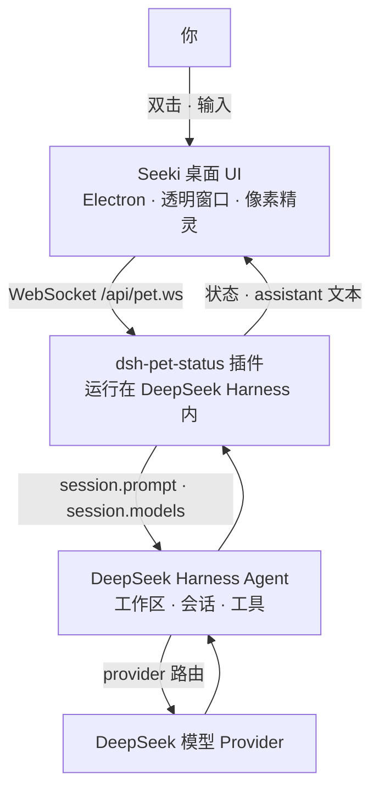

<div align="center">

# Seeki

**一只住在你桌面上的 DeepSeek 小桌宠，帮你把事情做完。**

*[English](./README.md) · [简体中文](./README_CN.md)*

Seeki 是一只会悬浮在桌面上的像素小精灵，让 [DeepSeek Harness](https://github.com/deepseek-ai/deepseek-harness) 的 agent 永远离你只有一次双击的距离。它是 **桌面宠物 × DeepSeek × Agent**——按工作区组织的持久对话、按任务切换模型，还有一个在 agent 干活时会做出反应的角色。

[](./LICENSE)
[](#参与贡献)


</div>

> Seeki 是一个独立社区项目，**不是** DeepSeek 官方产品。

---

## 为什么是 Seeki？

你本可以在浏览器标签页里直接和 DeepSeek 对话。Seeki 补上的是聊天界面给不了的那一层：

| 以前… | Seeki 给你… |
|---|---|
| 要去找那个标签页 | 一个**住在桌面**的角色，抬眼就能看到 |
| 每次会话都要重新粘贴上下文 | **持久对话**，按工作区整理 |
| 只有一个默认模型 | **按任务切换模型**——下一条消息换一个模型 |
| 一个静态网页 | 一只有待机 / 开心 / 走路 / 睡觉状态的**像素伙伴** |
| 看日志 | 角色头顶的**状态气泡**（收到 → 干活中 → 完成） |

上面每一条都对应 Seeki 今天真实存在的能力，没有营销空话。

---

## 特性

### 🐾 住在你的桌面上

Seeki 是一个透明、无边框、置顶的窗口——一只 2D 像素角色，一直待在你屏幕上，而不是躲在标签页里。

### 💬 持久对话

双击 Seeki 开始聊天。对话**持久、多轮**，按**工作区**整理，还能用会话切换器回到任意一条历史记录。

### 🧠 桌宠背后是一个 DeepSeek Harness agent

Seeki 是 [DeepSeek Harness](https://github.com/deepseek-ai/deepseek-harness) agent 的桌面形象。头顶气泡实时反映 agent 状态：

| 状态 | 气泡 |
|---|---|
| `received` | 收到啦 |
| `running` | Deep diving... |
| `completed` | Completed |
| `terminated` | Stopped |
| `offline` | Offline |

### 🔀 按任务切换模型

直接在聊天窗口切换你配置好的 DeepSeek 模型。切换只影响**下一条**消息，不打断正在运行的回合；新对话继承当前所选模型。

### 🎮 一个角色，不是一个静态图标

待机呼吸、开心、走路（拖动）、睡觉动画——外加按拖动方向切换（上下左右 + 镜像）、点击 / 超时交互。

### ⚙️ 配置驱动，无需改代码

状态气泡、动画、帧率、触发规则全部写在 `pet.config.json`，通过内置的 `/pet/settings` 页面即可编辑——包括**上传、替换、删除动画帧**。

---

## 截图

### 💬 对话


### 🗂️ 工作区 & 模型切换


### 🎮 角色状态


---

## 快速开始

### 前置条件

- **Node.js ≥ 22** 和 **pnpm**
- 克隆一份 [deepseek-harness](https://github.com/deepseek-ai/deepseek-harness) 并执行一次 `pnpm install`——Seeki 作为插件运行在它里面
- 为 harness 配置好 **DeepSeek API Key**（见 [模型配置](#模型配置)）

```sh
# 1. 克隆两个仓库
git clone https://github.com/deepseek-ai/deepseek-harness.git
git clone https://github.com/BenjaminSHI4008/deepseek-pet.git
cd deepseek-harness && pnpm install

# 2. 安装 Seeki（插件 + 桌面图标）
cd ../deepseek-pet
bash scripts/install.sh
```

```powershell
# Windows（PowerShell）
powershell -ExecutionPolicy Bypass -File scripts\install.ps1
```

3. **运行** — 双击 `Seeki.app`（macOS）/ `Seeki.lnk`（Windows）。图标会在后台拉起 DeepSeek Harness 并唤醒 Seeki。

安装脚本会自动探测你的 `deepseek-harness` 目录（同级目录、`~/deepseek-harness` 或 `~/Projects/deepseek-harness`），找不到时会提示你输入。

---

## 安装

两种运行方式，外加一个纯离线模式。

### A. 一键桌面图标（推荐）

`scripts/install.sh`（macOS）/ `scripts/install.ps1`（Windows）会安装插件，并生成一个**伪可执行文件**桌面图标——里面只含启动指令，不含打包产物。

- **启动：** 双击 → 后台拉起 harness → 唤醒 Seeki。
- **退出：** 右键桌宠 →「退出桌宠」。退出 Seeki **不会**停止 harness（它常驻后台，下次双击直接唤回桌宠）。

### B. 随 DeepSeek Harness 手动启动

```sh
cd <deepseek-pet>
bash scripts/install-harness-plugin.sh   # 把插件装进 web profile

cd <deepseek-harness>
pnpm dsh web                            # Seeki 随 harness 自动拉起
```

### C. 独立运行（离线，无 agent）

```sh
cd <deepseek-pet>
npm install
npm start
```

只运行桌宠本体。未连接 harness 时气泡显示 **Offline**。

> `npm install` 会下载 Electron 二进制。中国大陆网络较慢时，先执行
> `export ELECTRON_MIRROR="https://npmmirror.com/mirrors/electron/"`。

---

## 模型配置

Seeki 不硬编码模型。聊天窗口的模型列表来自你 DeepSeek Harness 配置好的 provider（`llm.models`），所以它总是反映 harness 实际公布的模型（例如 `deepseek-official` 路由下的 **DeepSeek-V4-Pro** 与 **DeepSeek-V4-Flash**）。

- **API Key** — 配置在 harness 上，不是配置在 Seeki 上：在环境变量、harness 根目录的 `.env` 文件、或 harness 的凭据存储（`~/.dsh/.credentials.yaml`）中设置 `DEEPSEEK_API_KEY`。
- **默认模型** — 使用 harness 自身的默认值，Seeki 不强制指定。
- **切换模型** — 用聊天标题栏的模型下拉。只影响**下一条**消息；新对话继承当前选择；不可用模型显示为禁用。

完整的 `pet.config.json` 参考：[docs/config.md](./docs/config.md)。

---

## 工作原理



1. **Electron 桌宠**渲染角色与聊天窗口。
2. 一个小型 **Cordis 插件**（`dsh-pet-status`）运行在 DeepSeek Harness 内，把 agent 活动收敛为状态，并通过本地 WebSocket 流式回传 assistant 文本。
3. harness 的 **agent** 负责会话、工作区与工具；Seeki 是它的桌面形象。

架构与扩展指南：[docs/development.md](./docs/development.md)。

---

## 目录结构

```
harness-plugin/     dsh-pet-status 插件——状态广播、桌宠管理器、聊天桥接
Deepseek/           像素精灵素材（动画、8 方向立绘、原始素材）
assets/             本地打包字体（以及生成的启动器图标）
docs/               配置参考 + 开发者指南
scripts/            安装脚本 + 素材标准化
pet.config.json     桌宠全部行为——状态、动作、角色状态
main.cjs            Electron 主进程（窗口、拖拽、WebSocket 客户端）
renderer.js         像素精灵状态机（配置驱动）
chat.html           聊天窗口 UI（工作区、会话、模型切换）
```

---

## 开发

```sh
npm install
npm start        # 独立运行桌宠（离线），方便迭代 UI
```

桌宠行为完全配置驱动——改 `pet.config.json`（或用 `/pet/settings`）即可改气泡、动画与触发，无需动渲染代码。如何加动作 / 加鼠标状态 / 加拖拽方向见 [docs/development.md](./docs/development.md)。

---

## 路线图

- [x] 桌面宠物（透明置顶窗口、像素状态机）
- [x] 与 agent 状态联动（`received` / `running` / `completed` / `terminated` / `offline`）
- [x] 聊天：工作区、会话历史、模型切换、打断
- [x] 可视化配置页（状态 / 动作 / 帧上传与删除）
- [x] 一键桌面启动器（`Seeki.app` / `Seeki.lnk`）
- [ ] 点击穿透（透明区域不拦截鼠标）
- [ ] 位置记忆、贴边、8 方向走路
- [ ] 独立打包（捆绑 harness 运行时）

---

## 参与贡献

欢迎提 Issue、功能建议和 Pull Request。

---

## License

[MIT](./LICENSE) © 2026 BenjaminSHI4008

`Deepseek/` 下的角色精灵素材由 [PixelLab](https://www.pixellab.ai/) 生成，再分发条款以 PixelLab 的授权说明为准。
